# Software Requirements Specification (SRS)

## Web-Based Enrollment System for Christian Bible Heritage Learning Center

**Document Version:** 4.0 (ISO/IEC/IEEE 29148:2018 Compliant)  
**Date:** January 2025  
**Standards Compliance:** ISO/IEC/IEEE 29148:2018 Requirements Engineering  
**Technology Stack:** Laravel 12 + React 18 + Inertia.js + shadcn/ui + Tailwind CSS  
**CI/CD Pipeline:** GitHub Actions (CI only) + Laravel Forge (Automatic Deployment)  
**Requirements Coverage:** Complete traceability matrix with priority classification and acceptance criteria  
**Authors:** Mhico D. Aro, Christian Kyle M. Masangcay, Manero SJ. Rodriguez, Carl Michael Tojino  
**Client:** Christian Bible Heritage Learning Center

---

## Table of Contents

1. [Introduction](#1-introduction)
2. [Overall Description](#2-overall-description)
3. [System Features](#3-system-features)
4. [Requirements Traceability and Priority](#4-requirements-traceability-and-priority)
5. [External Interface Requirements](#5-external-interface-requirements)
6. [Non-Functional Requirements](#6-non-functional-requirements)
7. [System Architecture](#7-system-architecture)
8. [Database Design and Requirements](#8-database-design-and-requirements)
9. [Constraints and Assumptions](#9-constraints-and-assumptions)
10. [Glossary](#10-glossary)
11. [Development Workflow and Standards](#11-development-workflow-and-standards)
    - [Local Development Setup](#111-local-development-setup)
    - [Code Standards and Best Practices](#112-code-standards-and-best-practices)
    - [Testing Strategy](#113-testing-strategy)
    - [CI and Deployment Process](#114-ci-and-deployment-process)
    - [Deployment Configuration](#115-deployment-configuration)
    - [Monitoring and Maintenance](#116-monitoring-and-maintenance)

---

## 1. Introduction

### 1.1 Purpose

This Software Requirements Specification (SRS) document describes the functional and non-functional requirements for the Web-Based Enrollment System for Christian Bible Heritage Learning Center (CBHLC). This system aims to digitize and streamline the currently manual enrollment process, providing an efficient, organized, and user-friendly platform for student registration.

### 1.2 Scope

The Web-Based Enrollment System will provide:

- Online student enrollment capabilities for parents/guardians
- Administrative tools for managing enrollment applications
- Role-based access control for different user types
- Digital record management and reporting capabilities
- Billing information display (view-only)
- Student report generation

### 1.3 Intended Audience

- **Primary Users:** Parents/Guardians of prospective and current students
- **Administrative Users:** School administrators and registrars
- **System Administrators:** IT personnel responsible for system maintenance
- **Stakeholders:** School management and teaching staff

### 1.4 Product Overview

The system replaces the current manual, paper-based enrollment process with a comprehensive web-based solution that allows parents to submit enrollment applications remotely while providing administrative staff with efficient tools for managing the enrollment workflow.

---

## 2. Overall Description

### 2.1 Product Perspective

The Web-Based Enrollment System is a standalone web application designed specifically for Christian Bible Heritage Learning Center. It addresses the institution's current challenges with manual enrollment processing by providing a digital platform accessible via web browsers.

### 2.2 Product Functions

- **User Authentication and Authorization**
- **Online Enrollment Form Submission**
- **Document Upload and Management**
- **Application Status Tracking**
- **Administrative Review and Approval Workflow**
- **Student Record Management**
- **Billing Information Display**
- **Report Generation**
- **Communication Tools**

### 2.3 User Characteristics

- **Parents/Guardians:** Varying levels of technical expertise; primarily concerned with ease of use and accessibility
- **Registrars:** Moderate technical skills; focus on efficiency and data accuracy
- **Administrators:** Basic to intermediate technical skills; require comprehensive system oversight capabilities

### 2.4 Operating Environment

- **Client Side:** Modern web browsers supporting React applications (Chrome, Firefox, Safari, Edge)
- **Server Side:** Laravel 12 framework with Inertia.js for SPA functionality
- **Database:** MySQL 8.0.43 Server (local installation on same server)
- **Development Environment:** Docker Compose with Laravel Sail
- **Deployment Platform:** DigitalOcean Droplet with Laravel Forge (Paid Subscription)
- **CI Pipeline:** GitHub Actions for automated testing and code quality checks
- **CD Pipeline:** Laravel Forge automatic deployment on push to main branch
- **Internet Connectivity:** Required for system access

### 2.5 Assumptions and Dependencies

- Users have access to internet-connected devices with modern web browsers supporting React applications
- DigitalOcean Droplet infrastructure managed via Laravel Forge (free trial)
- Docker environment available for local development with Laravel Sail
- GitHub repository configured with automated CI/CD pipeline
- Staff training will be provided for system usage
- Current enrollment policies and procedures remain applicable
- Modern JavaScript enabled in user browsers
- Development team has Laravel 12 experience and follows modern CI/CD practices

---

## 3. System Features

### 3.1 User Authentication System

#### 3.1.1 Description

Secure login/logout functionality with role-based access control ensuring appropriate system access for different user types.

#### 3.1.2 Functional Requirements

- **FR-1.1:** System shall provide secure login functionality for all user types
- **FR-1.2:** System shall implement role-based access control (RBAC)
- **FR-1.3:** System shall provide password reset functionality
- **FR-1.4:** System shall maintain user session management
- **FR-1.5:** System shall redirect users to appropriate dashboards based on roles

#### 3.1.3 User Roles (Spatie Laravel Permission Implementation)

- **Super Admin:** Complete system access with Gate::before bypass for all permissions
- **Administrator:** Full system access, user management, system configuration
- **Registrar:** Enrollment processing, student records management, reporting
- **Parent/Guardian:** Enrollment form submission, status tracking, billing information access
- **Student:** Limited access to own enrollment status and information

#### 3.1.4 Permission Structure

Spatie Laravel Permission package provides:

- **Role-based permissions:** Users assigned to roles inherit all role permissions
- **Direct permissions:** Individual permissions can be assigned directly to users
- **Guard-based separation:** Web and API guard permission separation
- **Permission caching:** Automatic permission caching for performance
- **Middleware protection:** Route-level role and permission middleware

#### 3.1.5 Core Permissions

- **student.view:** View student records
- **student.create:** Create new student records
- **student.update:** Update existing student records
- **student.delete:** Delete student records
- **enrollment.view:** View enrollment applications
- **enrollment.create:** Create enrollment applications
- **enrollment.update:** Update enrollment applications
- **enrollment.approve:** Approve enrollment applications
- **enrollment.reject:** Reject enrollment applications
- **documents.view:** View uploaded documents
- **documents.verify:** Verify document authenticity
- **reports.view:** View system reports
- **reports.generate:** Generate new reports
- **users.manage:** Manage user accounts and permissions
- **system.configure:** Configure system settings

### 3.2 Online Enrollment Module

#### 3.2.1 Description

Comprehensive online form for collecting student and guardian information, with integrated document upload functionality.

#### 3.2.2 Functional Requirements

- **FR-2.1:** System shall provide online enrollment form with required field validation
- **FR-2.2:** System shall support document upload (Birth Certificate, Report Cards, Form 138, Good Moral Certificate)
- **FR-2.3:** System shall accept JPEG and PNG file formats with maximum 50MB file size
- **FR-2.4:** System shall allow users to edit applications before final submission
- **FR-2.5:** System shall provide form save functionality for incomplete applications
- **FR-2.6:** System shall generate unique application reference numbers

#### 3.2.3 Required Information

- Student personal details (name, birthdate, address, gender, grade level)
- Guardian contact information (names, relationship, phone numbers, email)
- Previous academic records
- Supporting documents

### 3.3 Dashboard Module

#### 3.3.1 Description

Role-specific dashboards providing relevant information and functionality access for each user type.

#### 3.3.2 Functional Requirements

- **FR-3.1:** System shall provide customized dashboards for each user role
- **FR-3.2:** Parent dashboard shall display application status and school announcements
- **FR-3.3:** Administrative dashboards shall show system statistics and pending tasks
- **FR-3.4:** System shall display school calendar and important events
- **FR-3.5:** Dashboard shall provide quick access to frequently used functions

### 3.4 Enrollment Processing Module

#### 3.4.1 Description

Administrative tools for reviewing, approving, or rejecting enrollment applications.

#### 3.4.2 Functional Requirements

- **FR-4.1:** System shall provide application review interface for registrars
- **FR-4.2:** System shall allow approval, rejection, or request for additional information
- **FR-4.3:** System shall send status update notifications to parents
- **FR-4.4:** System shall maintain audit trail of all application actions
- **FR-4.5:** System shall support bulk processing of applications
- **FR-4.6:** System shall generate enrollment confirmation documents

### 3.5 Student Records Management

#### 3.5.1 Description

Comprehensive system for managing enrolled student information and academic records.

#### 3.5.2 Functional Requirements

- **FR-5.1:** System shall maintain complete student profiles
- **FR-5.2:** System shall support student information updates
- **FR-5.3:** System shall track enrollment history
- **FR-5.4:** System shall provide search and filter capabilities
- **FR-5.5:** System shall support data export functionality

### 3.6 Billing Module

#### 3.6.1 Description

View-only billing information display showing tuition fees and payment plans.

#### 3.6.2 Functional Requirements

- **FR-6.1:** System shall display tuition fee structures by grade level
- **FR-6.2:** System shall show available payment plans (Annual, Semestral, Monthly)
- **FR-6.3:** System shall generate billing statements for enrolled students
- **FR-6.4:** Parents shall be able to view their child's billing information
- **FR-6.5:** System shall calculate total fees including miscellaneous charges

### 3.7 Reporting Module

#### 3.7.1 Description

Report generation capabilities for administrative and statistical purposes.

#### 3.7.2 Functional Requirements

- **FR-7.1:** System shall generate enrollment statistics reports
- **FR-7.2:** System shall produce student demographic reports
- **FR-7.3:** System shall create class roster reports
- **FR-7.4:** System shall support report filtering by date, grade, and status
- **FR-7.5:** System shall export reports in multiple formats (PDF, Excel)

### 3.8 Communication Module

#### 3.8.1 Description

Tools for communication between parents and school administration.

#### 3.8.2 Functional Requirements

- **FR-8.1:** System shall provide inquiry form for parent-school communication
- **FR-8.2:** System shall display school contact information
- **FR-8.3:** System shall show school office hours
- **FR-8.4:** System shall support announcement broadcasting
- **FR-8.5:** System shall maintain communication history

---

## 4. Requirements Traceability and Priority

### 4.1 Requirements Traceability Matrix

The following matrix traces business needs to functional requirements, ensuring complete coverage of stakeholder objectives:

| Business Need                                | Stakeholder Requirement                         | Functional Requirement(s) | Priority | Verification Method     |
| -------------------------------------------- | ----------------------------------------------- | ------------------------- | -------- | ----------------------- |
| **BN-1:** Digitize manual enrollment process | **STR-1:** Online application submission        | FR-2.1, FR-2.2, FR-2.6    | Critical | System Testing          |
| **BN-2:** Secure access control              | **STR-2:** Role-based user management           | FR-1.1, FR-1.2, FR-1.5    | Critical | Security Testing        |
| **BN-3:** Document management efficiency     | **STR-3:** Digital document upload/verification | FR-2.3, FR-4.1, FR-4.2    | High     | Integration Testing     |
| **BN-4:** Application status transparency    | **STR-4:** Real-time status tracking            | FR-3.2, FR-4.3, FR-8.1    | High     | User Acceptance Testing |
| **BN-5:** Administrative workflow efficiency | **STR-5:** Streamlined review process           | FR-4.1, FR-4.4, FR-4.5    | High     | Process Testing         |
| **BN-6:** Student record management          | **STR-6:** Comprehensive student profiles       | FR-5.1, FR-5.2, FR-5.4    | Medium   | Data Testing            |
| **BN-7:** Billing transparency               | **STR-7:** Fee structure visibility             | FR-6.1, FR-6.2, FR-6.4    | Medium   | Display Testing         |
| **BN-8:** Data-driven decision making        | **STR-8:** Comprehensive reporting              | FR-7.1, FR-7.2, FR-7.5    | Medium   | Report Testing          |
| **BN-9:** Parent-school communication        | **STR-9:** Communication tools                  | FR-8.2, FR-8.4, FR-8.5    | Low      | Communication Testing   |

### 4.2 Requirements Priority Classification

Requirements are classified using the MoSCoW method:

#### 4.2.1 Critical Priority (Must Have)

- **Authentication System (FR-1.x):** Essential for system security
- **Online Enrollment (FR-2.1, FR-2.2, FR-2.6):** Core business functionality
- **Application Processing (FR-4.1, FR-4.2):** Primary administrative workflow

#### 4.2.2 High Priority (Should Have)

- **Document Management (FR-2.3, FR-4.4):** Important for complete workflow
- **Status Tracking (FR-3.2, FR-4.3):** User experience enhancement
- **Student Records (FR-5.1, FR-5.2):** Data management requirement

#### 4.2.3 Medium Priority (Could Have)

- **Billing Display (FR-6.x):** Information transparency
- **Basic Reporting (FR-7.1, FR-7.2):** Administrative convenience
- **Profile Management (FR-5.3, FR-5.4):** Extended functionality

#### 4.2.4 Low Priority (Won't Have Initially)

- **Advanced Communication (FR-8.x):** Future enhancement
- **Advanced Reporting (FR-7.3, FR-7.4, FR-7.5):** Nice-to-have features

### 4.3 Acceptance Criteria

#### 4.3.1 Critical Requirements Acceptance Criteria

**FR-1.1 (Secure Login):**

- **Given** valid user credentials
- **When** user attempts login
- **Then** system authenticates within 2 seconds and redirects to role-appropriate dashboard
- **And** invalid credentials show clear error message within 1 second

**FR-2.1 (Enrollment Form Validation):**

- **Given** incomplete enrollment form
- **When** user attempts submission
- **Then** system displays specific field validation errors
- **And** prevents submission until all required fields are completed
- **And** form data persists during validation cycles

**FR-4.1 (Application Review Interface):**

- **Given** registrar role user
- **When** accessing pending applications
- **Then** system displays applications with all required information visible
- **And** provides approve/reject/request-info actions
- **And** updates application status immediately upon action

#### 4.3.2 High Priority Requirements Acceptance Criteria

**FR-2.3 (Document Upload):**

- **Given** supported file format (JPEG/PNG) under 50MB
- **When** user uploads document
- **Then** system accepts file and displays upload confirmation
- **And** rejects unsupported formats with clear error message
- **And** provides upload progress indicator for files over 10MB

**FR-4.3 (Status Update Notifications):**

- **Given** application status change
- **When** registrar updates application
- **Then** parent receives notification within 1 minute
- **And** notification includes specific status and next steps
- **And** system maintains notification history

---

## 5. External Interface Requirements

### 5.1 User Interfaces

#### 5.1.1 General UI Requirements

- **UI-1:** Interface shall be responsive using Tailwind CSS responsive utilities across devices
- **UI-2:** Design shall incorporate CBHLC branding with customized shadcn/ui theme
- **UI-3:** Navigation shall be intuitive using consistent shadcn/ui navigation components
- **UI-4:** Forms shall utilize shadcn/ui form components with React Hook Form validation
- **UI-5:** Interface shall support accessibility standards (WCAG 2.1) via shadcn/ui's built-in accessibility features
- **UI-6:** Component consistency maintained through shadcn/ui's design system
- **UI-7:** Dark/light mode support available through Tailwind CSS and shadcn/ui theming

#### 5.1.2 Specific Interface Components

- **Login Page:** React component with shadcn/ui Card and Form components for secure authentication
- **Dashboard:** Role-specific React dashboards using shadcn/ui layout components and data visualization
- **Enrollment Form:** Multi-step React form utilizing shadcn/ui form components with real-time validation
- **Document Upload:** Drag-and-drop interface using shadcn/ui file input components
- **Administrative Panels:** Data management interfaces with shadcn/ui Tables, Modals, and Action components
- **Reporting Interface:** Interactive reports using shadcn/ui Charts and export functionality

### 5.2 Hardware Interfaces

- **HI-1:** System shall operate on standard web server hardware
- **HI-2:** Client access via standard computing devices (desktop, laptop, mobile)
- **HI-3:** File storage shall support document management requirements

### 5.3 Software Interfaces

#### 5.3.1 Web Server Interface

- **SI-1:** Nginx web server (configured via Laravel Forge)
- **SI-2:** PHP 8.2+ runtime with Laravel 12 framework (PHP 8.4 recommended for optimal performance)
- **SI-3:** SSL/TLS encryption via Let's Encrypt (automated by Laravel Forge)
- **SI-4:** Laravel Forge server provisioning and configuration management
- **SI-5:** GitHub Actions integration for automated deployment triggers

#### 5.3.2 Database Interface

- **SI-6:** MySQL 8.0 managed via Laravel's Eloquent ORM with Laravel 12 optimizations (MySQL 8.3+ recommended for production)
- **SI-7:** Database migrations and seeding via Laravel's migration system
- **SI-8:** Connection pooling managed by Laravel's database configuration
- **SI-9:** Automated backup and recovery via Laravel Forge
- **SI-10:** Database monitoring and performance optimization through Laravel Forge dashboard
- **SI-11:** Test database provisioning automated via GitHub Actions CI pipeline

#### 5.3.3 Browser Compatibility

- **SI-10:** Google Chrome (latest version) - Primary development target
- **SI-11:** Mozilla Firefox (latest version) - Full React support
- **SI-12:** Microsoft Edge (latest version) - Modern JavaScript compatibility
- **SI-13:** Safari (latest version) - iOS/macOS support
- **SI-14:** Mobile browsers supporting modern JavaScript (React applications)
- **SI-15:** Minimum ES2020 support required for React and Inertia.js functionality

---

## 6. Non-Functional Requirements

### 6.1 Performance Requirements

- **NFR-1.1:** Initial page load shall not exceed 2 seconds (optimized through React SSR and Inertia.js)
- **NFR-1.2:** Subsequent navigation shall be near-instantaneous (<500ms) via SPA functionality
- **NFR-1.3:** System shall support concurrent access by up to 50 users on Nanode infrastructure
- **NFR-1.4:** File uploads shall complete within 30 seconds for 50MB files with progress indication
- **NFR-1.5:** Database queries shall execute within 1 second (optimized via Laravel 12 Eloquent ORM and indexing)
- **NFR-1.6:** React component rendering shall be optimized to prevent layout shifts
- **NFR-1.7:** JavaScript bundle size shall be optimized through code splitting and tree shaking
- **NFR-1.8:** System downtime shall not exceed 2% annually (accounting for Nanode server specifications)
- **NFR-1.9:** CI/CD pipeline execution time shall not exceed 10 minutes for full test suite
- **NFR-1.10:** Automated deployments shall complete within 5 minutes via Laravel Forge

### 6.2 Security Requirements

- **NFR-2.1:** Laravel 12's enhanced authentication with bcrypt hashing and secure session management
- **NFR-2.2:** Personal data protection through Laravel's encrypted database columns and Philippines Data Privacy Act (DPA) compliance features
- **NFR-2.3:** RBAC implementation using Spatie Laravel Permission package with Laravel Gates and Policies integration
- **NFR-2.4:** Comprehensive audit logging using Laravel's event system and model observers
- **NFR-2.5:** File upload validation through Laravel 12's enhanced file validation rules and MIME type checking
- **NFR-2.6:** CSRF protection automatically handled by Laravel and Inertia.js integration
- **NFR-2.7:** SQL injection prevention through Eloquent ORM's parameter binding
- **NFR-2.8:** XSS protection via React's built-in escaping and Laravel's output sanitization
- **NFR-2.9:** Security vulnerability scanning automated via GitHub Actions CI pipeline
- **NFR-2.10:** Dependency security auditing using Composer audit in CI/CD pipeline

### 6.3 Reliability Requirements

- **NFR-3.1:** System availability shall be 99% during business hours
- **NFR-3.2:** Data backup shall occur daily with point-in-time recovery capability
- **NFR-3.3:** System shall implement graceful error handling and recovery
- **NFR-3.4:** Transaction integrity shall be maintained during system failures

### 6.4 Usability Requirements

- **NFR-4.1:** New users shall complete enrollment forms within 30 minutes
- **NFR-4.2:** System help documentation shall be comprehensive and accessible
- **NFR-4.3:** User interface shall be intuitive for users with basic computer skills
- **NFR-4.4:** Error messages shall be clear and provide actionable guidance

### 6.5 Scalability Requirements

- **NFR-5.1:** System shall accommodate 500+ student records
- **NFR-5.2:** Database shall support growth to 1000+ annual applications
- **NFR-5.3:** File storage shall scale to accommodate increasing document volumes
- **NFR-5.4:** System architecture shall support horizontal scaling

### 6.6 Maintainability Requirements

- **NFR-6.1:** Code shall follow established development standards
- **NFR-6.2:** System documentation shall be comprehensive and current
- **NFR-6.3:** Database schema shall support version migration
- **NFR-6.4:** System shall provide diagnostic and monitoring capabilities

---

## 7. System Architecture

### 7.1 Architectural Overview

The system follows a modern full-stack architecture leveraging Laravel 12's ecosystem:

- **Presentation Layer:** React 18+ based SPA with shadcn/ui components and Tailwind CSS styling
- **Application Layer:** Laravel 12 framework with Inertia.js 2.0 bridging server-side routing to client-side React components
- **Data Layer:** MySQL 8.0.43 database on local server managed via Laravel's Eloquent ORM
- **Development Environment:** Containerized using Docker Compose with Laravel Sail
- **CI/CD Pipeline:** GitHub Actions for automated testing, code quality checks, and security auditing
- **Deployment:** Single-server deployment with all components (web, app, database) on one DigitalOcean Droplet managed by Laravel Forge

### 7.2 Technology Stack

- **Frontend Framework:** React 18+ with TypeScript support
- **UI Components:** shadcn/ui component library (copy-paste approach with full customization)
- **CSS Framework:** Tailwind CSS v4 with utility-first styling
- **Full-Stack Bridge:** Inertia.js 2.0 (eliminating need for separate API)
- **Backend Framework:** Laravel 12 (PHP 8.3.25 installed)
- **Database:** MySQL 8.0.43 with Eloquent ORM (local installation)
- **Web Server:** Nginx 1.28.0 (configured via Laravel Forge)
- **Local Development:** Docker Compose with Laravel Sail (PHP 8.4 container)
- **CI/CD Pipeline:** GitHub Actions for continuous integration
- **Deployment Platform:** DigitalOcean Droplet managed by Laravel Forge
- **Version Control Integration:** Git with deployment options via GitHub Actions or Forge
- **Testing Framework:** Pest 4.0 (primary), PHPUnit compatibility maintained
- **Development Methodology:** Agile with iterative sprints and automated testing

### 7.3 Security Architecture

- **Authentication:** Laravel 12's enhanced authentication with bcrypt password hashing
- **Authorization:** Spatie Laravel Permission package integrated with Laravel's Gate and Policy system for RBAC implementation
- **CSRF Protection:** Laravel's automatic CSRF token handling via Inertia.js
- **Data Protection:** SSL/TLS encryption (Let's Encrypt certificates via Laravel Forge)
- **File Security:** Laravel 12's enhanced file validation and secure storage with configurable upload constraints
- **API Security:** Inertia.js eliminates exposed API endpoints, reducing attack surface
- **Server Security:** Laravel Forge automated security updates and firewall configuration
- **CI/CD Security:** GitHub Actions with automated security auditing using Composer audit
- **Dependency Security:** Automated vulnerability scanning and dependency updates via GitHub Actions
- **Code Quality Security:** Static analysis and security linting integrated in CI pipeline

### 7.4 Development Environment Architecture

- **Local Development:** Docker Compose with Laravel Sail providing consistent development environment
- **Container Services:** PHP 8.4 (Docker container), MySQL 8.0, Redis, Node.js 22 for asset compilation
- **Hot Module Replacement:** Vite development server integrated with Laravel for fast React development
- **Database Seeding:** Laravel factories and seeders for consistent development data
- **Testing Environment:** Pest 4.0 for primary testing (with PHPUnit compatibility), React Testing Library for frontend components, Browser testing capabilities via Pest v4
- **CI/CD Integration:** GitHub Actions workflows for automated testing, linting, and security checks
- **Pre-scaffolded Components:** Development team has pre-built core application structure and components

### 7.5 CI/CD Pipeline Architecture

- **Continuous Integration:** GitHub Actions workflows triggered on pull requests and pushes
- **Pipeline Stages:** Syntax validation, code style checks, static analysis, security auditing, automated testing
- **Test Strategy:** Fast-fail approach with PHP syntax check, PHPUnit/Pest test suite, and Laravel Dusk browser tests
- **Code Quality:** Automated linting, Laravel Pint code formatting, and Larastan static analysis
- **Security:** Composer audit for dependency vulnerabilities and automated security scanning
- **Build Optimization:** Composer dependency caching and optimized Docker layer caching
- **Multi-Environment Testing:** Matrix workflows testing across different PHP versions and environments
- **Deployment Trigger:** Successful CI pipeline triggers automated deployment via Laravel Forge

### 7.6 Deployment Architecture

- **Server Type:** DigitalOcean Droplet hosting all application components
- **Web Server:** Nginx 1.28.0 optimized for Laravel applications
- **Database Server:** MySQL 8.0.43 running locally on same server
- **Process Management:** PHP-FPM 8.3 with optimized worker configuration
- **SSL Certificates:** Available through Laravel Forge Let's Encrypt integration
- **File Storage:** Local filesystem on server SSD
- **Monitoring:** Laravel Forge server monitoring and performance metrics
- **Backup Strategy:** Database backups configurable through Laravel Forge
- **Deployment Options:** Manual via SSH, Laravel Forge quick deploy, or GitHub Actions automation

### 7.7 Asset Compilation and Management

- **Build Tool:** Vite for fast asset compilation and bundling
- **JavaScript Bundling:** React components and dependencies optimized for production
- **CSS Processing:** Tailwind CSS with PurgeCSS for optimized bundle sizes
- **Code Splitting:** Dynamic imports for optimized loading of React components
- **Asset Versioning:** Laravel Mix/Vite asset versioning for cache busting
- **CI Integration:** Automated asset building and optimization in GitHub Actions pipeline

---

## 8. Database Design and Requirements

### 8.1 Entity Relationship Diagram (ERD)

The following ERD illustrates the logical database structure for the Web-Based Enrollment System, designed following normalization principles to ensure data integrity and minimize redundancy.

```mermaid
erDiagram
    USER {
        id BIGINT PK
        name VARCHAR(255)
        email VARCHAR(255) UK
        email_verified_at TIMESTAMP
        password VARCHAR(255)
        role ENUM
        created_at TIMESTAMP
        updated_at TIMESTAMP
    }

    STUDENT {
        id BIGINT PK
        student_id VARCHAR(20) UK
        first_name VARCHAR(100)
        middle_name VARCHAR(100)
        last_name VARCHAR(100)
        birth_date DATE
        gender ENUM
        birth_place VARCHAR(255)
        nationality VARCHAR(100)
        religion VARCHAR(100)
        address TEXT
        phone VARCHAR(20)
        email VARCHAR(255)
        created_at TIMESTAMP
        updated_at TIMESTAMP
    }

    GUARDIAN {
        id BIGINT PK
        first_name VARCHAR(100)
        middle_name VARCHAR(100)
        last_name VARCHAR(100)
        relationship ENUM
        occupation VARCHAR(100)
        employer VARCHAR(255)
        phone VARCHAR(20)
        email VARCHAR(255)
        address TEXT
        emergency_contact BOOLEAN
        created_at TIMESTAMP
        updated_at TIMESTAMP
    }

    ENROLLMENT_APPLICATION {
        id BIGINT PK
        application_number VARCHAR(50) UK
        student_id BIGINT FK
        grade_level ENUM
        school_year VARCHAR(9)
        application_status ENUM
        submission_date TIMESTAMP
        review_date TIMESTAMP
        approval_date TIMESTAMP
        reviewer_id BIGINT FK
        notes TEXT
        created_at TIMESTAMP
        updated_at TIMESTAMP
    }

    STUDENT_GUARDIAN {
        id BIGINT PK
        student_id BIGINT FK
        guardian_id BIGINT FK
        is_primary BOOLEAN
        created_at TIMESTAMP
        updated_at TIMESTAMP
    }

    DOCUMENT {
        id BIGINT PK
        student_id BIGINT FK
        document_type ENUM
        original_filename VARCHAR(255)
        stored_filename VARCHAR(255)
        file_path VARCHAR(500)
        file_size INT
        mime_type VARCHAR(100)
        upload_date TIMESTAMP
        verification_status ENUM
        verified_by BIGINT FK
        verified_at TIMESTAMP
        created_at TIMESTAMP
        updated_at TIMESTAMP
    }

    GRADE_LEVEL {
        id BIGINT PK
        level_code VARCHAR(10) UK
        level_name VARCHAR(100)
        description TEXT
        age_range VARCHAR(20)
        capacity INT
        tuition_fee DECIMAL
        miscellaneous_fee DECIMAL
        active BOOLEAN
        created_at TIMESTAMP
        updated_at TIMESTAMP
    }

    ENROLLMENT_PERIOD {
        id BIGINT PK
        school_year VARCHAR(9) UK
        start_date DATE
        end_date DATE
        early_registration_deadline DATE
        regular_registration_deadline DATE
        late_registration_deadline DATE
        status ENUM
        created_at TIMESTAMP
        updated_at TIMESTAMP
    }

    ROLE {
        id BIGINT PK
        name VARCHAR(125) UK
        guard_name VARCHAR(125)
        created_at TIMESTAMP
        updated_at TIMESTAMP
    }

    PERMISSION {
        id BIGINT PK
        name VARCHAR(125) UK
        guard_name VARCHAR(125)
        created_at TIMESTAMP
        updated_at TIMESTAMP
    }

    MODEL_HAS_PERMISSIONS {
        permission_id BIGINT FK
        model_type VARCHAR(255)
        model_id BIGINT
    }

    MODEL_HAS_ROLES {
        role_id BIGINT FK
        model_type VARCHAR(255)
        model_id BIGINT
    }

    ROLE_HAS_PERMISSIONS {
        permission_id BIGINT FK
        role_id BIGINT FK
    }

    AUDIT_LOG {
        id BIGINT PK
        user_id BIGINT FK
        action VARCHAR(100)
        model_type VARCHAR(100)
        model_id BIGINT
        changes JSON
        ip_address VARCHAR(45)
        user_agent TEXT
        performed_at TIMESTAMP
    }

    SYSTEM_SETTING {
        id BIGINT PK
        key VARCHAR(100) UK
        value TEXT
        description TEXT
        type ENUM
        created_at TIMESTAMP
        updated_at TIMESTAMP
    }

    NOTIFICATION {
        id BIGINT PK
        user_id BIGINT FK
        title VARCHAR(255)
        message TEXT
        type ENUM
        read_at TIMESTAMP
        created_at TIMESTAMP
        updated_at TIMESTAMP
    }

    %% Relationships
    USER ||--o{ ENROLLMENT_APPLICATION : reviews
    USER ||--o{ DOCUMENT : verifies
    USER ||--o{ AUDIT_LOG : performs
    USER ||--o{ NOTIFICATION : receives
    USER ||--o{ MODEL_HAS_ROLES : hasRoles
    USER ||--o{ MODEL_HAS_PERMISSIONS : hasDirectPermissions

    ROLE ||--o{ MODEL_HAS_ROLES : assignedToUsers
    ROLE ||--o{ ROLE_HAS_PERMISSIONS : hasPermissions
    PERMISSION ||--o{ MODEL_HAS_PERMISSIONS : assignedDirectly
    PERMISSION ||--o{ ROLE_HAS_PERMISSIONS : assignedToRoles

    STUDENT ||--|| ENROLLMENT_APPLICATION : submits
    STUDENT ||--o{ DOCUMENT : uploads
    STUDENT ||--o{ STUDENT_GUARDIAN : has

    GUARDIAN ||--o{ STUDENT_GUARDIAN : guardianOf

    ENROLLMENT_APPLICATION }|--|| GRADE_LEVEL : appliesTo
    ENROLLMENT_APPLICATION }|--|| ENROLLMENT_PERIOD : duringPeriod

    DOCUMENT }|--|| USER : verifiedBy
```



### 8.2 Entity Descriptions

#### 8.2.1 Core Entities

- **USER**: System users including administrators, registrars, and parents with role-based access control
- **STUDENT**: Complete student information including personal details and contact information
- **GUARDIAN**: Parent/guardian information with relationship details and emergency contact designation
- **ENROLLMENT_APPLICATION**: Central entity tracking enrollment requests with status workflow
- **STUDENT_GUARDIAN**: Junction table managing many-to-many relationship between students and guardians

#### 8.2.2 Supporting Entities

- **DOCUMENT**: File management for uploaded documents with verification tracking
- **GRADE_LEVEL**: Academic level configuration with capacity and fee structure
- **ENROLLMENT_PERIOD**: School year and registration deadline management
- **AUDIT_LOG**: System activity tracking for compliance and security
- **SYSTEM_SETTING**: Application configuration parameters
- **NOTIFICATION**: User notification management system

### 8.3 Data Storage Requirements

- **Student information and enrollment applications** with full audit trail
- **User accounts and authentication data** with secure password hashing
- **Document metadata and file references** with verification status tracking
- **System configuration and settings** with administrative controls
- **Audit logs and activity tracking** for compliance and security monitoring
- **Notification system** for user communications

### 8.4 Database Constraints and Rules

#### 8.4.1 Primary Key Constraints

- All tables use `BIGINT` auto-incrementing primary keys for optimal performance
- Unique application numbers generated automatically for enrollment applications
- Composite unique constraints on junction tables to prevent duplicates

#### 8.4.2 Foreign Key Constraints

- **Enrollment Applications** must reference valid students and grade levels
- **Document verification** must reference valid administrator users
- **Audit logs** maintain referential integrity with user accounts
- **Cascade delete rules** implemented for data consistency

#### 8.4.3 Data Validation Rules

- **Email addresses** validated using Laravel's built-in validation rules
- **Phone numbers** formatted according to local standards
- **File uploads** restricted by type, size, and security scanning
- **Enumerated values** for status fields to ensure data integrity
- **Date ranges** validated for logical consistency (birth dates, enrollment periods)

#### 8.4.4 Business Rules Implementation

- **Application workflow** enforced through status enum transitions
- **Grade level capacity** checked before enrollment approval
- **Document requirements** validated based on grade level and student type
- **Enrollment period constraints** prevent applications outside valid timeframes
- **Guardian relationship** rules ensure at least one primary guardian per student

### 8.5 Data Backup and Recovery

- **Daily automated backups** via Laravel Forge with 7-day retention
- **Point-in-time recovery capability** using MySQL binary logs
- **Disaster recovery procedures** with offsite backup storage
- **Data retention policies** compliant with educational record requirements
- **Backup verification** automated testing of restore procedures

### 8.6 Data Integrity and Security

- **Referential integrity constraints** enforced at database level
- **Transaction consistency** using Laravel's database transactions
- **Concurrency control** with optimistic locking for critical operations
- **Data encryption** for sensitive information using Laravel's encryption
- **Access logging** for all data modification operations
- **Philippines Data Privacy Act (DPA) compliance** features for data subject rights and privacy protection as required by the National Privacy Commission (NPC)

### 8.7 Performance Considerations

- **Database indexing** on frequently queried columns (email, application_number, student_id)
- **Query optimization** through Eloquent ORM relationship eager loading
- **Connection pooling** managed by Laravel's database configuration
- **Caching strategy** for lookup tables and frequently accessed data
- **Pagination** for large result sets to maintain response times

---

## 9. Constraints and Assumptions

### 9.1 System Constraints

- **CONS-1:** No online payment processing functionality
- **CONS-2:** No academic grading or performance tracking
- **CONS-3:** Internet connectivity required for system access
- **CONS-4:** File upload limited to 50MB per document
- **CONS-5:** System operates in English language only

### 9.2 Business Constraints

- **CONS-6:** Must comply with CBHLC enrollment policies
- **CONS-7:** Implementation within academic year constraints
- **CONS-8:** Budget limitations for infrastructure
- **CONS-9:** Staff training requirements

### 9.3 Technical Constraints

- **CONS-10:** Web-based deployment only
- **CONS-11:** Compatible with existing school infrastructure
- **CONS-12:** Modern web technologies with Laravel 12 framework requirements
- **CONS-13:** Single-school deployment (not multi-tenant)
- **CONS-14:** PHP 8.2+ runtime requirement (PHP 8.4 recommended)
- **CONS-15:** GitHub repository required for CI/CD pipeline
- **CONS-16:** CI pipeline execution time limited to 10 minutes

### 9.4 Assumptions

- **ASS-1:** Users have basic computer and internet skills with modern browser support
- **ASS-2:** Reliable internet connectivity available for SPA functionality
- **ASS-3:** DigitalOcean Droplet managed via Laravel Forge (Paid Subscription) with automatic deployments
- **ASS-4:** Current enrollment procedures remain applicable
- **ASS-5:** Staff will receive adequate system training including React-based interface usage
- **ASS-6:** Development team has experience with Laravel 12, React, and Inertia.js
- **ASS-7:** Docker environment available for local development setup
- **ASS-8:** GitHub Actions CI/CD pipeline is configured and operational
- **ASS-9:** Core application structure has been pre-scaffolded by development team
- **ASS-10:** PHPUnit 11+ and Pest 3+ testing frameworks are properly configured
- **ASS-11:** Automated testing and deployment processes are reliable and maintainable

---

## 10. Glossary

| Term               | Definition                                                                        |
| ------------------ | --------------------------------------------------------------------------------- |
| **CBHLC**          | Christian Bible Heritage Learning Center                                          |
| **RBAC**           | Role-Based Access Control                                                         |
| **SRS**            | Software Requirements Specification                                               |
| **UI**             | User Interface                                                                    |
| **SPA**            | Single Page Application                                                           |
| **SSL/TLS**        | Secure Sockets Layer/Transport Layer Security                                     |
| **CRUD**           | Create, Read, Update, Delete operations                                           |
| **MVP**            | Minimum Viable Product                                                            |
| **UAT**            | User Acceptance Testing                                                           |
| **ORM**            | Object-Relational Mapping                                                         |
| **Inertia.js**     | Modern monolith framework bridging server-side Laravel with client-side React     |
| **shadcn/ui**      | Copy-paste React component library built on Radix UI and Tailwind CSS             |
| **Laravel Sail**   | Docker-based local development environment for Laravel                            |
| **Laravel Forge**  | Server provisioning and deployment service for Laravel applications               |
| **Eloquent**       | Laravel's built-in ORM (Object-Relational Mapping) system                         |
| **Vite**           | Fast build tool and development server for modern web applications                |
| **Linode Nanode**  | Entry-level VPS offering from Linode (1GB RAM, 1 CPU, 25GB SSD)                   |
| **GitHub Actions** | CI/CD platform for automated testing, building, and deployment workflows          |
| **PHPUnit**        | PHP testing framework for unit and feature testing (compatibility maintained)     |
| **Pest**           | Elegant PHP testing framework with expressive syntax - Primary testing framework  |
| **Pest v4**        | Latest version with browser testing capabilities and Laravel integration          |
| **Laravel Pint**   | Opinionated PHP code style fixer built for Laravel                                |
| **Larastan**       | Static analysis tool for Laravel applications                                     |
| **Composer Audit** | Security vulnerability scanner for PHP dependencies                               |
| **CI/CD**          | Continuous Integration and Continuous Deployment pipeline                         |
| **Fast-Fail**      | CI strategy that stops pipeline execution on first failure to save resources      |
| **ERD**            | Entity Relationship Diagram - Visual representation of database structure         |
| **Mermaid**        | JavaScript-based diagramming tool for creating diagrams from text definitions     |
| **Junction Table** | Intermediary table that resolves many-to-many relationships between entities      |
| **RBAC**           | Role-Based Access Control - Security model for managing user permissions          |
| **Audit Trail**    | Chronological record of system activities for compliance and security             |
| **DPA**            | Philippines Data Privacy Act of 2012 - National privacy and data protection law   |
| **NPC**            | National Privacy Commission - Regulatory body for data privacy in the Philippines |

---

## 11. Development Workflow and Standards

### 11.1 Local Development Setup

- **Environment:** Laravel Sail with Docker Compose
- **Installation:** `curl -s https://laravel.build/cbhlc-enrollment | bash` (Laravel 12)
- **Services:** PHP 8.2+ (PHP 8.4 recommended), MySQL 8.3+, Redis, Node.js, Mailpit
- **Frontend Development:** Vite dev server with Hot Module Replacement (HMR)
- **React Development:** TypeScript support with shadcn/ui components
- **Pre-scaffolded:** Core application structure and components already implemented

### 11.2 Code Standards and Best Practices

- **Backend:** Laravel 12 coding standards with PSR-12 compliance
- **Frontend:** React 18+ function components with TypeScript
- **Component Library:** shadcn/ui components with customization through CSS variables
- **Styling:** Tailwind CSS v4 utility-first approach with custom design system
- **State Management:** React hooks and Inertia.js 2.0 shared data
- **Form Handling:** React Hook Form with shadcn/ui form components
- **Code Quality:** Laravel Pint for automated code formatting
- **Static Analysis:** Larastan for PHP static analysis

### 11.3 Testing Strategy

- **Primary Testing Framework:** Pest 4.0 with elegant PHP testing syntax and browser testing capabilities
- **Backend Testing:** Feature and unit tests using Pest 4.0 (PHPUnit compatibility maintained)
- **Frontend Testing:** React Testing Library for component testing
- **Browser Testing:** Pest v4 browser testing for end-to-end tests (replaces Laravel Dusk)
- **API Testing:** Inertia.js response testing via Pest Laravel plugin
- **CI Testing:** GitHub Actions pipeline with fast-fail approach
- **Test Database:** Automated test database provisioning and cleanup via GitHub Actions
- **Coverage:** Code coverage reporting integrated in CI pipeline

### 11.4 CI and Deployment Process

- **Version Control:** Git-based workflow with feature branches and pull requests
- **Continuous Integration:** GitHub Actions workflows for testing and quality checks
- **CI Pipeline Stages (GitHub Actions):**
    - PHP syntax validation
    - Code style formatting (Laravel Pint)
    - Static analysis (Larastan)
    - Security auditing (Composer audit)
    - Automated testing (PHPUnit/Pest)
    - TypeScript/ESLint checks
    - Prettier formatting validation
- **Continuous Deployment:** Laravel Forge automatic deployment (Paid Subscription)
- **Forge Deployment Features:**
    - Automatic deployment on push to main branch
    - Zero-downtime deployments
    - Deployment script customization
    - Environment variable management
    - SSL certificate management
    - Database backup before deployment
    - Deployment notifications
    - Quick rollback capability
- **Environment Management:** Laravel Forge environment configuration
- **Database Migrations:** Automated via Forge deployment script
- **Asset Compilation:** Vite build process in Forge deployment script
- **Deployment Strategy:** Zero-downtime deployments with automatic health checks

### 11.5 Deployment Configuration

#### 11.5.1 Server Information

- **Host:** 128.199.161.224
- **Platform:** DigitalOcean Droplet (All-in-one deployment)
- **Web Server:** Nginx 1.28.0 (Laravel Forge managed)
- **PHP Version:** 8.3.25
- **Database:** MySQL 8.0.43 (local installation)
- **Project Path:** `/home/forge/default`
- **User:** forge (deployment and application user)
- **SSH Access:** Available via `ssh cbhlc` (forge user) or `ssh cbhlc-root` (root user)

#### 11.5.2 Server Components

All components run on a single server for simplified management:

- **Laravel Application:** Located at `/home/forge/default`
- **MySQL Database:** Local instance on 127.0.0.1:3306
- **Nginx Web Server:** Configured with Laravel Forge
- **PHP-FPM:** Process manager for PHP execution
- **Composer:** Installed at `/usr/local/bin/composer`
- **Node.js:** Available for asset compilation

#### 11.5.3 Database Configuration

- **Database Name:** forge
- **Database User:** forge
- **Database Host:** 127.0.0.1 (local)
- **Database Port:** 3306
- **Connection:** Direct local socket connection for optimal performance

#### 11.5.4 Deployment Workflow

The deployment workflow is automated via Laravel Forge:

**Laravel Forge Automatic Deployment (Primary Method)**

- Laravel Forge (Paid Subscription) monitors the GitHub repository
- Automatic deployment triggers on push to `main` branch
- Zero-downtime deployments with health checks
- Built-in rollback capabilities if deployment fails
- No manual intervention required

**Deployment Process:**

1. Push code to `main` branch on GitHub
2. Laravel Forge detects the push via webhook
3. Forge pulls latest code from repository
4. Runs deployment script (composer install, npm build, migrations, etc.)
5. Gracefully reloads PHP-FPM without downtime
6. Sends deployment notifications

**Manual Deployment via SSH (Backup Method)**

```bash
ssh cbhlc
cd /home/forge/default
git pull origin main
composer install --optimize-autoloader --no-dev
npm ci && npm run build
php artisan migrate --force
php artisan config:cache
php artisan route:cache
php artisan view:cache
```

#### 11.5.5 Server Management

- **SSH Access:**
    - Application management: `ssh cbhlc` (forge user)
    - System administration: `ssh cbhlc-root` (root access)
- **Log Files:** Located in `/home/forge/default/storage/logs`
- **Nginx Config:** `/etc/nginx/sites-available/default`
- **PHP-FPM:** Managed via systemctl
- **MySQL:** Local database accessible via forge user

#### 11.5.6 Troubleshooting

- **Application Errors:** Check Laravel logs at `/home/forge/default/storage/logs/laravel.log`
- **Web Server Issues:** Review Nginx error logs
- **Database Connection:** Verify MySQL service status and credentials in `.env`
- **Permission Issues:** Ensure forge user owns application files
- **Cache Problems:** Clear all caches with `php artisan cache:clear`

### 11.6 Monitoring and Maintenance

- **Server Monitoring:** Laravel Forge comprehensive server metrics and alerts (Paid Features)
- **Application Monitoring:** Laravel's built-in logging and error tracking
- **Deployment Monitoring:** Laravel Forge deployment history and notifications
- **Performance Monitoring:** Database query optimization and React component profiling
- **Security Updates:** Automated server security updates via Laravel Forge
- **CI Monitoring:** GitHub Actions workflow execution monitoring and failure notifications
- **Dependency Management:** Automated security vulnerability scanning in CI pipeline
- **Code Quality Monitoring:** Continuous code quality metrics via GitHub Actions
- **Forge Features:**
    - Server health monitoring
    - Deployment success/failure tracking
    - Database backup management
    - SSL certificate monitoring
    - Queue worker monitoring
    - Scheduled job monitoring

---

## Appendix A: Form 138

Official school record form required for student transfer between schools in the Philippines.

## Appendix B: Good Moral Certificate

Document certifying a student's good moral character and conduct from their previous school.

---

**Document Control:**

- Initial Version: 1.0 (January 2025) - Original requirements specification
- Version 2.0: (January 2025) - Updated with actual technology stack implementation
- Version 3.0: (January 2025) - Updated with Laravel 12 and GitHub Actions CI/CD pipeline
- Version 3.1: (January 2025) - Added comprehensive ERD and database design section
- Version 4.0: (January 2025) - Full ISO/IEC/IEEE 29148:2018 compliance with requirements traceability, priority classification, and acceptance criteria
- **Version 4.1: (January 2025) - Added deployment configuration and GitHub Actions CI workflow documentation**
- **Version 4.2: (January 2025) - Updated to Laravel Forge paid subscription with automatic deployment**
- Standards Compliance: ISO/IEC/IEEE 29148:2018 Systems and Software Engineering - Requirements Engineering
- Technology Stack: Laravel 12 + React 18 + Inertia.js + shadcn/ui + Tailwind CSS
- CI Pipeline: GitHub Actions (Testing and Code Quality only)
- CD Pipeline: Laravel Forge Automatic Deployment (Paid Subscription)
- Development Environment: Docker Compose with Laravel Sail
- Deployment Platform: DigitalOcean Droplet managed by Laravel Forge (Paid)
- Database Design: 11-entity ERD with full normalization and business rules
- Requirements Engineering: Complete traceability matrix linking 9 business needs to 40+ functional requirements
- Project Status: Core components pre-scaffolded, CI/CD pipeline configured
- Document Status: ISO/IEC/IEEE 29148:2018 compliant SRS with comprehensive requirements engineering
- Quality Assurance: MoSCoW priority classification and Given-When-Then acceptance criteria for critical requirements
- Next Review Date: February 2025
- Approved By: [To be completed]

---

_This document serves as the official Software Requirements Specification for the Web-Based Enrollment System for Christian Bible Heritage Learning Center. All stakeholders should review and approve this document before development commences._

# Important Instructions for Development

## Testing Commands

ALWAYS use the following commands for testing:

### Run Tests with Coverage

```bash
./vendor/bin/sail pest --coverage --min=60 --coverage-html=coverage --coverage-clover=coverage.xml
```

### Run Specific Test Files

```bash
./vendor/bin/sail pest path/to/test/file.php
```

### Run Tests with Stop on Failure

```bash
./vendor/bin/sail pest --stop-on-failure
```

## Code Style Fixing

ALWAYS use Laravel Pint for code style fixes:

```bash
./vendor/bin/pint
```

Or for specific files:

```bash
./vendor/bin/pint path/to/file.php
```

## Important Development Rules

1. **NEVER skip Husky pre-push hooks** - Always ensure all tests pass and code coverage meets the 60% minimum threshold
2. **ALWAYS run tests before pushing** - Make sure all tests are passing
3. **ALWAYS use Sail for Laravel commands** - Prefix all artisan and composer commands with `./vendor/bin/sail`
4. **ALWAYS maintain code coverage above 60%** - Write tests for all new code
5. **ALWAYS follow Laravel conventions** - Use existing patterns and conventions in the codebase
6. **NEVER create files unless absolutely necessary** - Prefer editing existing files
7. **NEVER proactively create documentation** - Only create docs when explicitly requested

## Common Commands

### Database Migrations

```bash
./vendor/bin/sail artisan migrate
```

### Clear Caches

```bash
./vendor/bin/sail artisan cache:clear
./vendor/bin/sail artisan config:clear
./vendor/bin/sail artisan route:clear
```

### Generate IDE Helper Files

```bash
./vendor/bin/sail artisan ide-helper:generate
./vendor/bin/sail artisan ide-helper:models
```

## Do what has been asked; nothing more, nothing less.

NEVER assume or add features that weren't explicitly requested.
